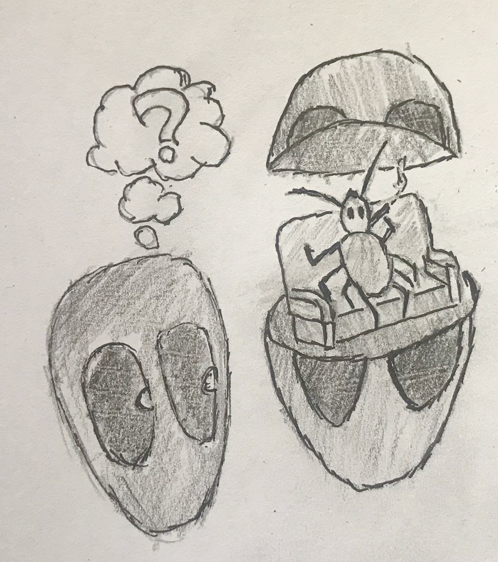
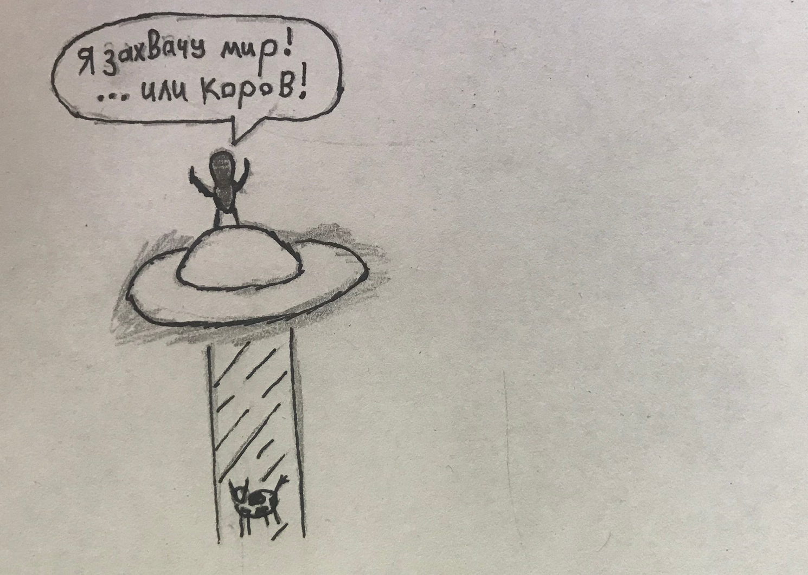
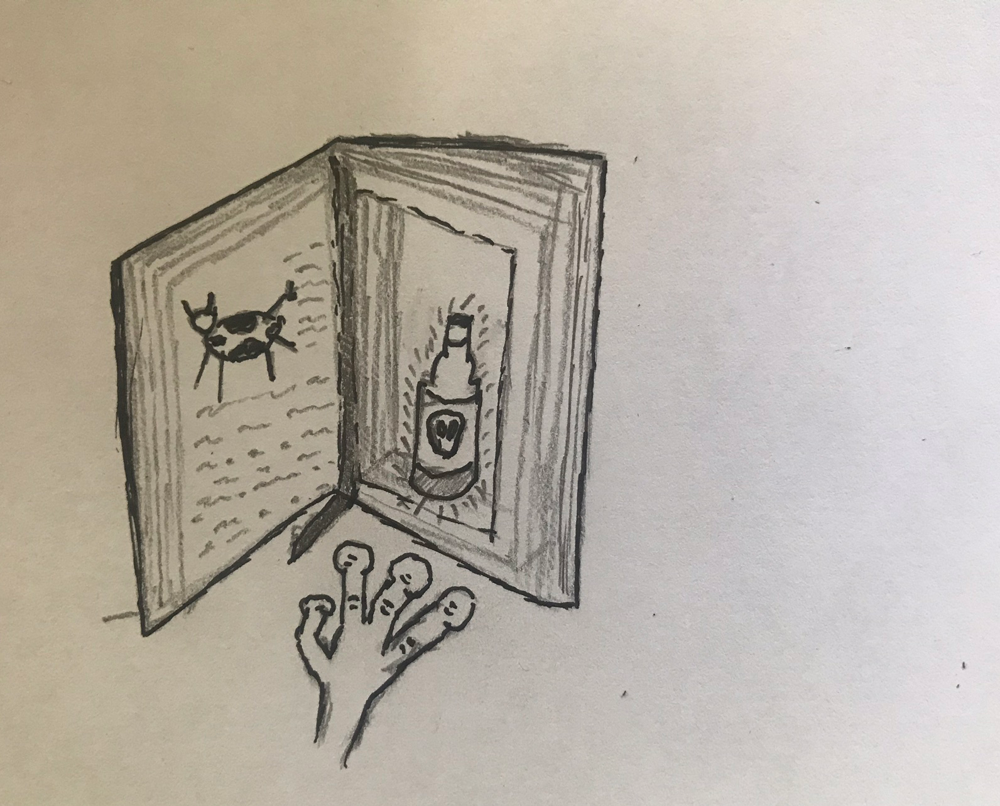
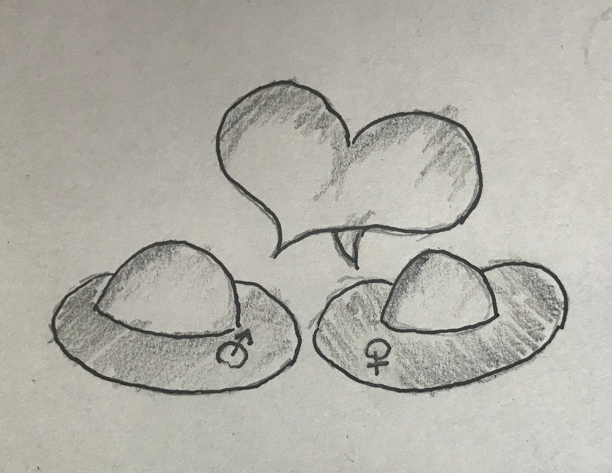

# JavaScript. Самая понятная книга в галактике

### Зачем нужно вступление?

Язык этой книги несколько своеобразный. Есть у меня любимый таракан - стараться говорить живо, понятно и с юмором. Я лучше разжую тему по 10 раз, чем оставлю вас у разбитого корыта вопросов: "Что с этим делать?", "А почему всё происходит именно так?" и т.д. Познакомьтесь с моим изложением в этом разделе и, если вам оно придётся не по душе - смело ищите себе другого учителя. Своего автора, учителя, психиатра нужно найти. Универсальных людей и объяснений, увы, не бывает. 

Замечали ли вы, что все люди - ненормальные? Я в том числе. Поэтому давайте я вас сразу предупрежу текстом ниже, чтобы вы представляли масштаб трагедии.

Хорошего чтения!

### Кто я такой?

Добрый день, дорогие друзья!  
Меня зовут Владимир Языков и я - самый понятный программист в Галактике! Пока за мной не приехали санитары \(хотя, судя по результатам Евровидения 2014-ого года, времени у меня достаточно много\), я постараюсь сделать что-то полезное. Те, кто со мной знакомы, понимают, что моё самопровозглашённое нарицание - гибербола и практически оксюморон.

В 2017-ом году состоялся небольшой мой юбилей: исполнился 10-ый год моей профессиональной деятельности в web-индустрии. Будучи немногочисленным среди обитателей нашей планеты ценителем труда, в обилии самостоятельно организованной работы я и вовсе забыл самого себя поздравить. Поэтому, если у вас возникнет непреодолимое желание прислать мне тортик \(не напрашиваюсь\), сообщаю свои координаты:

E-mail: [neizerth@gmail.com](mailto:neizerth@gmail.com)  
Вконтакте: [https://vk.com/neizerth](https://vk.com/neizerth)  
Facebook: [https://www.facebook.com/vladimir.yazykov](https://www.facebook.com/vladimir.yazykov)

Иногда меня спрашивают о том, кто я вообще такой и как до жизни докатился, поэтому на всякий случай не буду дожидаться и организую скромное подобие "Минуты славы". Родился, живу \(и возможно умру\) в Москве, в сумме выполнил более 150 проектов, больших и маленьких. из крупных клиентов были компании S7, ВТБ, Теле2. В работе люблю всё амбициозное и технически навороченное, особое наслаждение - нахождение элегантных решений задач.

С 2009-ого года начал крутиться счётчик моего педагогического стажа: сначала очно для старшеклассников, потом - в онлайн-режиме в составе компаний Geekbrains и Нетология. Ручаюсь, что своими глазами в этом онлайне видел порядка 2000 человек, которых и обучал на курсах вёрстки \(HTML/CSS\), JavaScript и PHP. Тех, кто записался и, возможно когда-то посмотрел, я отследить не смог, но статистика говорит о примерно 40 тысячах людей.

И ныне этот счётчик обучения продолжает крутиться - я веду как курсы в закрытых группах вне каких-либо компаний, так и индивидуальное обучение. Всех заинтересовавшихся приглашаю связаться со мной по контактам выше.

### Зачем мне нужно писать эту книгу?

То, что вы сейчас имеете удовольствие читать - не учебник по языку JavaScript в привычном понимании вещей. У меня нет задачи добавить вам в копилку дополнительный язык, поскольку для меня существует одно весомое но. А именно: знать язык программирования - не значит быть программистом.

За время своей профессиональной деятельности я побывал на обеих берегах реки информационных технологий: на берегах исполнителя и заказчика. Порой и там и там творится полная катастрофа. О трудностях, с которыми предстоит столкнуться, я бегло проговорил в своём видео на канале, которое вы можете посмотреть [по ссылке](https://www.youtube.com/edit?o=U&video_id=Jjmgg1SP_e4).

Я по своей же инициативе решил взять на себя задачу облагораживания сферы IT. Я хочу, чтобы качество оказываемых услуг, равно как и коммуникативные навыки в России, странах СНГ и вообще всём мире становилось лучше. Ибо я не могу смотреть на это безучастно. Также тяжело мне становится при просмотре фильмов ужасов - я чувствую, что не могу помочь этим людям, а им там, за экраном, становится хуже.

### Цель этой книги

Как и писал выше, я хочу, чтобы книга помогла вам стать Человеком и Программистом с больших букв, а не просто тем, кто знает JavaScript. В последнем-то как раз проблем меньше всего - обучающих пособий, сайтов и курсов горы.

### О содержании

Данное пособие покрывает современный стандарт языка Javascript и будет полезным как тем, кто только начинает свой путь в изучении web-технологий, так и профессиональным разработчикам. Я создаю его с любовью для всех, в особенности учеников моего образовательного портала [learn.u-w.me](http://learn.u-w.me/).

### Поддержать проект

Данный проект развивается на основе альтруистических начал автора. Впрочем, вы всегда можете поддержать его:

* подписавшись на Youtube-канал Useful Web о веб-технологиях и поставив лайки понравившимся видеозаписям. Пускай хорошего в мире веб технологий будет больше
* вступив в ряды бойцов Знания на сайте [learn.u-w.me](http://learn.u-w.me/)
* подписавшись на группу Вконтакте или Facebook
* помочь рублём на бравое дело

