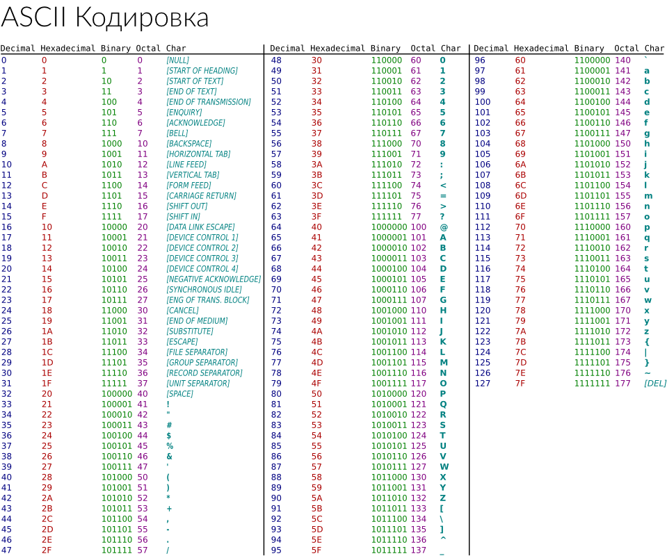

# Глава 1. Быстрый старт

> **Что Вы узнаете**: Самая необходимая информация для понимания работы JavaScript и того, зачем он нужен.
> Раздел содержит более **20** практических заданий для закрепления пройденного материала. Выполняйте его последовательно, приостанавливая процесс чтения. Старайтесь не пользоваться интернетом и подсказкой друзей/зала.

----

> **Систематизация опыта**: Скорее всего, Вы будете читать данную главу не один день. Поэтому рекомендую сразу приступить к Выполнению одного из домашних заданий этой глаВы: созданию дневника успехов. Это может быть блог, закрытая группа или блокнот, куда Вы будете писать свои наблюдения и успехи в IT-сфере. Ритмичный ежедневный успех важен больше, чем работа с наскока. Лучше каждый день по 15 минут, чем один день в неделю по одному часу. Пишите ваши наблюдения, прочитанные статьи и просмотренные видео. Это существенно поможет Вам систематизировать свою жизнь, не допуская разнузданного будущего.
>
> Помимо этого, приучите себя писать конспект или ментальную карту полученных знаний, которые были бы понятны и нужны, в первую очередь, Вам.

----

> **Примечание**: если Вы не знаете JavaScript и при этом имеете опыт в программировании, настоятельно рекомендую выполнять честно все задания. Не стоит тешить себя надеждами: понимание приходит только во время практики.

----
[TOC]

## Практика 1: Начало
> **Что Вы узнаете**: Минимальный код для старта JavaScript с объяснениями, последовательность выполнения кода и отображения тегов на странице

Давайте напишем нашу первую программу на языке JavaScript!

> **Примечание**: Быстрый старт здесь и далее сделан для того, чтобы идти от простого к сложному. Постарайтесь удержать себя от соблазна остановиться на простом и только это использовать в своей практике. Это пагубная привычка, закрывающая доступ к новым знаниям и обучению.
> Начиная с данной главы, я рекомендую Вам завести отдельную папку на вашем компьютере для хранения всех Ваших решений задач и набросков. Рекомендуемая структура:

	/js-book
		/01-fast-start
			/1
				index.html
> То есть, создавайте под каждую главу и задание в ней отдельную папку, если для решения задания будет больше одного файла. В качестве альтернативы Вы можете использовать онлайн-сервис для хранения Ваших набросков (как, например, в ссылке на исходный код 1-ого задания). В таком случае, рекомендуемая структура может быть такой:

	/js-book
		/01-fast-start.txt
> где 01-fast-start.txt - текстовый файл в удобном для Вас формате со ссылками на Ваши решения.

### Задание 1
[Исходный код](https://jsfiddle.net/usefulweb/kaLu0uqa/)
C помощью текстового редактора или IDE создайте файл с именем fast-start-1.html со следующим содержимым:

```html
<!DOCTYPE html>
<html lang="ru">
<head>
  <meta charset="UTF-8">
  <title>Быстрый старт JavaScript</title>
</head>
<body>
  <h1>Это просто Космос!</h1>
  <script>alert( 'Добрый день, это самое понятное сообщение в Галактике' );</script>
</body>
</html>
```


Затем, сохраните это содержимое и запустите полученный html файл (достаточно два раза нажать на нём или перенести файл внутрь окна/вкладки браузера). 

Поздравляю! Наша первая программа написана! Надо отметить, что это уже не просто HTML код, включающий разметку содержимого, но уже и определённые команды браузеру для выполнения нужных действий.

Обратите внимание, после запуска Вы получите всплывающее окно с надписью: «Добрый день, это самое понятное сообщение в Галактике».

### Задание 2.1
[Возможное решение](https://www.evernote.com/shard/s253/sh/a70fb2d3-bb83-411c-85e9-caa25e523dbc/331febcac2849a796eb2b0cc0504c83b)
Вы точно выполнили предыдущее задание? У меня, к сожалению, нет возможности постоянно об этом напоминать. Поэтому ожидаю вашей честности к самому себе.

Постарайтесь подробно описать, в каком порядке происходят события, начиная с открытия html файла и что происходит после закрытия окна. Пишите это языком простого человека, не подкованного в IT-технологиях. Описывайте события максимально детально.

> **Внимание!**: ответы на этот вопрос нужно найти самостоятельно, без подсказки со стороны знакомых и интернета. Пусть Вы будете продвигаться на пути обучения этой книгой медленно, но зато это будет Ваше личное понимание, что в сто крат ценнее. Не важно, правильно ли Вы ответите - важно, что ответите **Вы**, а не сосед за стенкой. Это полезная практика, поскольку она не разучит Вас думать. 
> Это нормально, если сейчас у Вас могут возникать трудности с более чётким изъяснением мыслей. Всё приходит с длительными тренировками. И я верю - получится и у Вас.

### Задание 2.2
[Решение](https://www.evernote.com/shard/s253/sh/1cde8777-8563-4e68-88db-5d3d21f5278f/fd4edc7b463407661ef4aef59f856ea1)
Проанализируйте, что именно в коде выше стало причиной возникновения этого окна и что - текста внутри него.

> **Внимание**: ответы на этот вопрос нужно найти самостоятельно, без подсказки со стороны знакомых и интернета. 
>
> **Примечание**: Для того, чтобы проверить свои догадки, Вам потребуется любопытство. Меняйте содержимое в этом коде до тех пор, пока не придёте к какому-либо выводу. Найдите случаи, при которых программа будет неработоспособной, сделайте выводы.

### Пояснения
В данном примере ключевой разгадкой служит:

```html
<script>alert( 'Добрый день, это самое понятное сообщение в Галактике' );</script>
```

Любая программа, написанная на языке JavaScript, должна использовать специальный тег *\<script\>*. Таким образом, браузер понимает, где начинается программный код. 

> **Примечание**: До стандарта HTML5 было важным указывать и специальный атрибут **type**, который однозначно сообщал браузеру о типе данных внутри тега:

```html
<script type="text/javascript">alert( 'Добрый день, это самое понятное сообщение в Галактике' );</script>
```
> В настоящий момент данный атрибут имеет смысл использовать только при поддержке старых браузеров (в первую очередь, Internet Explorer 8 и более ранних версий)

#### В чём польза?
Сообщение, которое мы поместили в кавычки, вывелось во всплывающем окне без них, что, на первый взгляд, странно. На самом деле, таким образом мы можем сообщить браузеру о том, что мы передаём произвольный текст. В терминологии, которую мы будем использовать далее, любое содержимое, которое находится в таких кавычках, называется *строкой*. Это один из типов данных, с которым Вы познакомитесь позднее.

Какая практическая польза в нашем коде? С помощью всплывающих окон можно выводить массу полезной информации:

- сообщение о добавленном в корзину товаре;
- поздравление с тем, что наш посетитель является миллионным/юбилейным пользователем по счёту;
- предупреждение о устаревшем браузере с рекомендацией обновления;
- отладка промежуточного состояния Вашего кода. Например, можно вывести количество пользователей, которые находятся в чате онлайн для проверки правильности Вашего кода, и т.д.

#### Что такое alert?
*alert* - специальная функция, доступная в браузере, которая позволяет выводить на экран всплывающее окно с заданным текстом. Под функциями обычно понимают какой-то программный код, который можно использовать в необходимое время. Обычно код функций пишут JavaScript-разработчики, но в настоящий момент создатели браузера любезно позаботились об этом, встроив некоторый функционал по умолчанию. В дальнейшем Вы будете сталкиваться с большим числом встроенных возможностей языка.

#### Зачем нужны круглые скобки?
Так как alert - уже существующий код, его каким-либо образом необходимо запустить. Если просто написать

```html
<script>alert();</script>
```
то на экране появится просто всплывающее окно без какого-либо текста.
В свою очередь, строка

```html
<script>alert;</script>
```
вообще ни к чему не приведёт. Соответственно, эмпирическим путём можно прийти к тому, что именно наличие круглых скобок приводит в действие адский механизм всплывающего окна, а указание текста в кавычках внутри этих скобок - своеобразная настройка этого окна. 

#### Зачем нужна точка с запятой?

JavaScript предлагает возможность выполнения нескольких операций (как мы понимаем, языки программирования пошли намного дальше однозадачных мужчин). Для этого необходимо операции разделить символом «;»:

```html
<script>alert( 'Кальмар' );alert( 'Вольдемар' );</script>
```
В этом примере второе окно появится только после того, как первое будет закрыто.
Код внутри тега может быть отформатирован и в более удобном виде:

```html
<script>
alert( 'Добрый день, это самое понятное сообщение в Галактике' );
</script>
```
**В данном случае**, переносы на новую строку между кодом, как и пробелы, табуляции (смещение текста после нажатия на клавишу *Tab*) никак не будут влиять на результат выполнения программы. Так будет всегда, если в конце выражения будет стоять точка с запятой. Если Вы уже дали волю экспериментам, то могли заметить, что код нормально выполнится и без «;». Но так будет не всегда. И, чтобы не привлечь в свою работу нежелательных ошибок, примите за правило всегда ставить этот символ при любой возможности (про это будет сказано отдельно).

#### Как Выполняется JavaScript-код?
В нашем примере, когда указан тег *\<script\>*, браузером считываются атрибуты, а также содержимое тега (если оно имеется). Операции считываются в JavaScript друг за другом, чему особенно способствует «;». При коде, где каждая операция располагается на своей строчке, точка с запятой **обычно** (кроме случаев, которые будут оговорены позднее), ставится автоматически, поэтому допустим данный фрагмент кода:

```html
<script>
alert( 'Кальмар' )
alert( 'Вольдемар' )
</script>
```
Как и на Бога в знаменитой пословице, на этот символ лучше никогда не надеяться и самостоятельно его добавлять.


### Задание 3
[Исходный код](https://jsfiddle.net/usefulweb/kx2vx725/) | [Возможное решение](https://www.evernote.com/shard/s253/sh/73ea84fd-b79d-45b6-bf6b-457c543cb7c6/c7362bb70b78fac4763fe3e8e373938a)
C помощью текстового редактора или IDE создайте файл с именем fast-start-3.html со следующим содержимым:

```html
<!DOCTYPE html>
<html lang="ru">
<head>
  <meta charset="UTF-8">
  <title>Быстрый старт JavaScript</title>
</head>
<body>
  <h1>Это просто <script>document.write( 'Космос!' )</script></h1>
  <h2>Галактика любит каждого!</h2>
</body>
</html>
```
Ответьте на вопросы:

1. Что, на Ваш взгляд, делает функция document.write?
2. Почему фраза «Это просто Космос!» вывелась целиком (не разбилась на две строчки, фраза «Космос!» не вывелась после заголовка «Галактика любит каждого!»)? Какие выводы Вы можете сделать из этого?
3. Какие последствия могут быть, если внутри тега *\<script\>* будет очень медленный код, который будет выполняться минуту?
4. Что плохого в этом коде?

### Пояснения

#### Когда Выполняется JavaScript-код?


Между примерами 1-ого и 3-его заданий есть небольшая разница в положении тега *\<script\>*. В первом случае, он находился в конце страницы, во втором - в середине документа. В данных примерах код JavaScript выполняется сразу же, как только встретится тег *\<script\>*, не дожидаясь загрузки страницы. Одним словом, чем раньше код появится на странице, тем раньше он выполнится.

#### Зачем нужен document.write?
Как мы ранее убедились, кто-то продолжает настойчиво писать за нас код. document.write в этом случае - не исключение. С помощью этой функции (в данном случае правильно называть *write* методом объекта *document*) мы можем Выводить произвольное содержимое (в том числе и HTML-код) непосредственно на страницу.

Практическая польза от кода выше весьма сомнительная: постепенно в браузерах только растёт количество ограничений, связанных с применением этого метода. Дело в том, что document.write:

- может увеличить число потенциальных ошибок при разработке;
- может стереть содержимое страницы будучи вызванным после загрузки всего документа;
- может замедлить вывод страницы за счёт блокировки отображения.

Словом, в настоящий момент, такой подход скорее скорее обратит колесо Сансары против Вас. Задумайтесь, хотите ли Вы вечность прожить в теле программиста?
Данный антипример был показан исключительно в целях демонстрации последовательного выполнения кода на странице и блокировки страницы. Пожалуйста, не повторяйте его в комнатных условиях.

#### Где лучше разместить \<script\>?
Давайте обсудим небольшие предпосылки, которые помогут Вам сделать вывод.

1. Браузеру нужно время для того, чтобы распознать JavaScript код. Чем больше вставок \<script\> будет между обычными тегами HTML, тем более ощутимыми будут замедления интерфейса до формирования всей страницы целиком.
2. Очень-очень редко встречаются ситуации, при которых необходимо выполнять код до показа страницы.

Исходя из этой информации, где бы Вы старались разместить тег \<script\>?

Правильный ответ - по возможности, как можно ниже на странице. Не подумайте, я не претендую «правильными ответами» на Ваше право самостоятельно принимать решения, я просто предупредил.

Конечно, в данном варианте код из примера 3 совсем не будет работать так, как бы этого хотелось:

```html
<!DOCTYPE html>
<html lang="en">
<head>
  <meta charset="UTF-8">
  <title>Быстрый старт JavaScript</title>
</head>
<body>
  <h1>Это просто</h1>
  <h2>Галактика любит каждого!</h2>
  <script>document.write( 'Космос!' )</script>
</body>
</html>
```
Но в перспективе оно того стоит. Для того, чтобы вернуться к решению этой задачи, нам придётся пройти вместе огонь, воду и миллиампер часы Вашего аккумулятора и докопаться-таки до истины. Вы готовы?

----

> **Ваши успехи**: Запишите ваши мысли и наблюдения в дневник успехов, составьте конспект или ментальную карту по полученной информации.

## Теория 1: Что такое JavaScript и зачем он нужен?

> **Что Вы узнаете**: История создания языка и почему знать её важно, сферы применения Javascript.

Пожалуй, это то, с чего обычно начинается почти любая техническая литература. В данном случае, я ставлю задачу именно научить, а не рассказать. Поэтому, я постараюсь пристроиться к Вашему сознанию и в гармонии с ним образовывать Вас.

Вы видели пример работы языка в браузере. Но на этом не ограничиваются возможности JavaScript. В настоящий момент, с помощью него возможно:

- создание веб-сайтов различной сложности как на стороне браузера, так и на стороне сервера (платформы NodeJS и Rhino);
- «сборка» веб-сайта (gulp, webpack и т.д.);
- создание браузерных дополнений;
- создание приложений для всех популярных операционных систем (Windows, macOS, Linux) настольных компьютеров и ноутбуков;
- создание интерактивный чат-ботов для мессенджеров Skype, Telegram и т.д.;
- создание мобильных приложений для Android и iOS;
- управление устройствами вроде квадрокоптеров, систем наблюдения.

JavaScript многогранен и чрезвычайно популярен и порой его слава слишком преувеличена. Несмотря на то, что я являюсь сторонником данного языка, я считаю, что многопрофильность никак не связана с качеством. Есть вещи, с которыми язык справляется лучше всего (это, прежде всего, всё, что касается взаимодействия с браузером). Есть и те, что можно спокойно вычеркнуть из списка.

> Как-то раз, в одном торговом центре я решил пообедать в ресторанном дворике. Решил остановиться на восточной кухне, которая была чересчур красивая на вид. На деле всё оказалось безвкусной резиной. Как и говорят, внешность обманчива.

Что нас, прежде всего, ждёт?

1. Работа с языком в рамках браузера;
2. Основы создания дополнений для браузера;
3. Особенности сборки веб-проектов;
4. Написание своего чат-бота для Telegram и Skype;
5. Изучение особенностей серверной платформы NodeJS.

Несмотря на то, что язык называется JavaScript, спецификация, которая описывает его стандарт, называется Ecmascript. Зачем такие сложности?

### С чего всё начиналось

> Давным-давно,
> В далёкой-далёкой галактике...

JavaScript изначально создавался для упрощения проверки форм на web-странице. В далёком 1995-ом году она осуществлялась в лучшем случае через низкоскоростные модемы, а уж на просторах бывшего советского пространства такую роскошь могли себе позволить чаще всего зажиточные люди и работники научно-исследовательских институтов.

В любом случае, находиться на интерактивном сайте, где необходимо было зарегистрироваться или просто ввести свой псевдоним в чате было задачей не для слабонервных. Вы могли нажать на кнопку и только через минуту получить ответ о том, что что-то пошло не так...

В какой-то момент группой инициативных американцев из компании Netscape под предводительством Брендона Эйха (Brandon Eich), находящейся на пике инноваций, было решено создать новый язык, который бы скрасил в будущем жизнь одиноких мужчин, предающих себя власти бинарных опционов. 

До своего привычного названия, JavaScript успел несколько раз его поменять. Сначала язык именовали Mocha (некоторыми соотечественниками читается в очень некультурной форме), потом - LiveScript. И под конец, Netscape объединила свои усилия с Sun Microsystems, которой кода-то принадлежала разработка языка для микроволновок Java и сыграть на популярности последнего.

Думаю, мало кто думал, что интернет будет настолько популярен. Думали ли в Netscape (нынешняя Mozilla) о том, что Sun Microsystems будет поглощена Oracle через 15 лет?
Как бы то ни было, лицензия на использование торговой марки JavaScript принадлежит компании Mozilla. Это решение привело к следующим последствиям: 

- дабы избежать проблем с лицензированием и желанием включить JavaScript в браузер Internet Explorer, компания Microsoft использовала имя JScript;
- по тем же причинам название в стандарте языка соответствует ECMAScript.

Словом, солидная неразбериха началась уже тогда. Но, как говорил современник:

> Есть всего два типа языков программирования: те, на которые люди всё время ругаются, и те, которые никто не использует. (Bjarne Stroustrup)

### Примеры применения JavaScript в браузере

Вот неполный список того, что делают с помощью JavaScript:

- Проверка введённых данных.
- Интерактивность на сайте:
  - фотогалереи
  - онлайн-чат;
  - интерактивные калькуляторы;
  - элементы интерфейса: выбор цвета, даты и т.д.;
  - отправка заявок на сервер
- Мультимедиа:
  - аудио-/видеоплеер
  - генерация звуков
  - видеоконференции
- Развлекательная индустрия:
  - игры
- Работа с графикой:
  - анимация
  - рисование на странице (образовательные инетрактивные доски)
  - работа в 3D-пространстве
- Работа со страницей без перезагрузки:
  - загрузка файлов
  - навигация по страницам
- Работа с файлами: формирование и изменение.

----

> **Ваши успехи**: Запишите ваши мысли и наблюдения в дневник успехов, составьте конспект или ментальную карту по полученной информации.

## Практика 2: Составляющие языка

> **Что Вы узнаете**: Что такое ECMA-262, BOM, DOM и как они между собой взаимодействуют.

Реализация языка разделена на три части, взаимодействие с которыми мы с Вами разберём в данном примере:

### Задание 4
[Исходный код](https://jsfiddle.net/usefulweb/vgum0mq0/) | [Возможное решение](https://www.evernote.com/shard/s253/sh/ec9516e6-47b9-4931-81ef-8ef489a720f0/495ab5bbe8d26b885394be32980f7beb)
C помощью текстового редактора или IDE создайте файл с именем fast-start-4.html со следующим содержимым:

```html
<!DOCTYPE html>
<html lang="ru">
<head>
  <meta charset="UTF-8">
  <title>Быстрый старт JavaScript</title>
</head>
<body>
  <button onclick="alert( 'Хорошо сделано!' );">Сделать хорошо</button>
</body>
</html>
```
Нажмите на кнопку на странице и проанализируйте:

1. Что или кто является причиной возникновения окна?
2. Что или кто показывает данное окно?
3. Что именно в данном коде заставляет окно появиться?
4. На Ваш взгляд, почему всплывающее окно появляется только после нажатия на кнопку?

### Пояснения

Внутри JavaScript при работе в браузере, как и говорилось Выше, можно выделить следующие составные части:

1. Сам стандарт языка, ECMA-262. Он определяет основные структуры и конструкции языка и взаимедействие между ними.
2. Взаимодействие с браузером - объектная модель браузера (BOM, Browser Object Model). Это многочисленные возможности, связанные с открытием новых вкладок, перехода по ссылкам, геометрию окон (ширина/высота) и т.д.
3. Взаимодействие с XML или HTML-документом (например, web-страницей) - объектная модель документа (DOM, Document Object Model). Например, это добавление и удаление новых элементов на странице (примером такого может являться бесконечная лента новостей), изменение размеров элементов, цвета и т.д.

### Задание 5
[Решение](https://www.evernote.com/shard/s253/sh/d788a92e-b9ac-4bd1-b208-a230231e3f43/4b6e324a6cb0144e2833d7fddcb2b60f)

Определите, что в задании выше, на Ваш взгляд, относится к ECMA-262, BOM и DOM. Не бойтесь ошибиться.

### Пояснения

Так как мы уже ранее оговаривали, что функция alert запускается браузером, вполне логично относить её к объектной модели браузера, BOM. 

Также, из текста выше известно, что DOM взаимодействует с документом. И, поскольку нажатие на кнопку и получение результата в виде отображения окна является таковым взаимодействием, нужно понять, что приводит к выводу этого окна. Это и будет разгадкой.

В задании выше Вы уже нашли ответ на этот вопрос, поэтому можно говорить, что к DOM относится атрибут onclick и его содержимое.

Для того, чтобы ответить на оставшийся вопрос, давайте пойдём от обратного: будем удалять из кода всё то, что гарантированно не имеет отношения к ECMA-262.

Для начала удалим HTML, который никак не влияет на программу:

```html
  <button onclick="alert( 'Хорошо сделано!' );">Сделать хорошо</button>
```
Теперь - то, что относится к BOM:

```html
  <button onclick="'Хорошо сделано!';">Сделать хорошо</button>
```
И то, что относится к взаимодействию:

```html
  <button 'Хорошо сделано!';>Сделать хорошо</button>
```
Последний штрих. Удаляем лишний HTML-код:

```javascript
'Хорошо сделано!';
```
Это и будет ответом на наш вопрос.

----

> **Ваши успехи**: Запишите ваши мысли и наблюдения в дневник успехов, составьте конспект или ментальную карту по полученной информации.

## Практика 3: Хранение кода в файлах

> **Что Вы узнаете**: Как использовать отдельные от HTML файлы для хранения и запуска JS, преимущества и недостатки данного подхода.

### Задание 6
[Решение](https://plnkr.co/edit/vUko2H?p=info)
1. Создайте два файла: index.html и contacts.html. В первом из них разместите небольшую информацию о себе, во втором - как с Вами можно связаться. Свяжите две страницы с помощью навигационного меню. 
2. Добавьте раздел «Товары» вместе с 3 страницами произвольных продуктов (например, «Чёрная дыра», «Плутон», «Луна»)
3. Сделайте так, чтобы при посещении каждой из страниц выводилось сообщение: «Добро пожаловать в Галактику!»
4. Поменяйте содержимое всплывающего окна на «Галактика открыта каждому!». Обязательно выполните перед этим предыдущий пункт.

### Пояснения
Почувствовали неудобства (если нет, выполните данное задание ещё раз)? Будет здорово, если получится сохранить код появления всплывающего окна в одно место и постоянно к нему обращаться (главное, чтобы всё это не было через «одно место»). Сделать всё это можно с помощью файлов, как и в CSS.

Для этого в теге *\<script\>* пользуются атрибутом *src*:

```html
<script src="bobik.js"></script>
```
В данном случае предполагается, что файл *bobik.js* должен находиться в той же папке, что и HTML-файл, содержащий тег *\<script\>* выше. Принцип формирования ссылки на файл такой же, как и в атрибуте *src* для тегов *\*, *\<input\>*, *\<iframe\>* и пр.

> **Метод Бобика**: Зачастую, исходный код матёрых программистов настолько логичен, что становится непонятна разница: это такая особенность языка или всё же воплощение внутреннего мира разработчика? Для разрешения такой проблемы, в коде часто будет встречаться нелогичное слово **bobik**, которое вряд ли когда-либо окажется в стандарте хотя бы одного языка.

Для абсолютных ссылок:

```html
<script src="http://proto-bobik.com/bobik.js"></script>
```
В случае защищённого протокола HTTPS:

```html
<script src="https://secure-bobik.ru/bobik-contents/bobik.js"></script>
```

Самый первый пример с файлом в той же папке является полным аналогом варианта с добавлением «./», где точка обозначает текущий каталог (папку):

```html
<script src="./bobik.js"></script>
```
Мы можем «гулять» по файловой системе не только вглубь, но и поднимаясь на уровень вверх.
Предположим такую структуру:

```
	/js-book
		/01-fast-start
			/1
				index.html
			/2
				bobik.js
```
Для того, чтобы из файла *index.html* подключить содержимое файла *bobik.js*, нам необходимо написать следующий код в HTML-файле:

```html
<script src="../2/bobik.js"></script>
```

Обозначение «../» указывает браузеру на то, что необходимо заглянуть в каталог уровнем выше, то есть в папку *01-fast-start*

Также, возможна ситуация, где Вы храните свой JavaScript-файл на сайте <code>https://superbobik.com</code>, где возможна следующая адресация:

```html
<script src="https://superbobik.com/bobik-source/bbbbboboik.js"></script>
```

В случае, если Вы как посетитель уже находитесь на ресурсе <code>https://superbobik.com</code>, то Вы спокойно можете опустить называние домена. Тогда адрес будет таким:

```html
<script src="/bobik-source/bbbbboboik.js"></script>
```

### Задание 7
Будет ли разница в случае, если Вы напишете вместо последнего примера код вида:

```html
<script src="bobik-source/bbbbboboik.js"></script>
```
Напишите развёрнутый ответ.

### Задание 8
[Решение](https://plnkr.co/edit/UyW15h8oWa6PENEuaFxt)

Оптимизируйте работу Вашего проекта так, чтобы все страницы использовали один JavaScript-файл. Желательно сделать копию папки ответов прошлого задания и работать в ней отдельно. Будьте внимательны, функционал должен остаться неизменным - всё также на каждой странице должно появляться всплывающее окно с заданным текстом.

### Пояснения
Возможно, Вы были в растерянности от того, что же размещать внутри файла. Ответ простой: всё, что находилось между открывающей и закрывающей частями тега *script*: 

```javascript
alert( 'Галактика открыта каждому!' );
```
Вот краткий список преимуществ хранения кода в файле перед прямой вставкой внутри *\<script\>*:

1. Повторное использование кода;
2. Возможность разделения частей на визуальную (HTML/CSS) и программную;
3. Разделение кода большого проекта на составные части;
4. Кэширование. При специальной настройке сервера и первом обращении посетителя на сайт, файл сохраняется на его компьютере. Повторное обращение к файлу приводит к ускорению загрузки страницы за счёт того, что посетителю возвращается содержимое с его компьютера.

#### Зачем нужен script без src?
Если с хранением файлов всё так замечательно, пользуются ли прямой вставкой содержимого внутрь тега *\<script\>*? И если да, то зачем?

Вот возможный список ситуаций, где такая практика Вам будет полезна:

1. Для загрузки сайта требуется на один запрос больше (запрос браузера загрузить один файл с сервера). Это может увеличить время загрузки самого кода из-за плохого соединения, перегрузки сервера и т.д.
2. Чем больше ссылок на файл хранится в *\<script\>*, тем больше времени нужно, чтобы загрузился целиком Ваш код.
3. Хранение содержимого в файле для разработчиков сторонних библиотек, расширяющих функционал JS может пагубно сказаться на отказоустойчивости. Если они хранят код на своём сервере, который, в свою очередь, пользуется спросом и часто подгружается всеми желающими, есть риск частых неисправностей сервера из-за высокой нагрузки.

#### Что Выбрать?

Хорошей практикой является хранение кода в файлах как можно ближе к закрывающему тегу *\<body\>*. Также, в окончательной версии проекта, которой будут пользоваться люди, желательно сократить количество файлов до одного, поместив в него содержимое из всех файлов, наполняющих проект. И только в редких случаях Вам может пригодиться *\<script\>*

----

> **Ваши успехи**: Запишите ваши мысли и наблюдения в дневник успехов, составьте конспект или ментальную карту по полученной информации.

## Теория 2: DOM, в котором мы живём

> **Что Вы узнаете**: Этапы формирования страницы, в какой момент можно запустить JavaScript, а также взаимодействие JavaScript с объектными моделями документа и CSS.

Как браузер понимает все кракозябры, которые мы пишем в HTML и CSS?
Вот общее представление:

> Байты -> Символы -> Разметка -> Узлы -> Объектная модели -> Модель визуализации

### Байты и кодировка

Всё начинается с того, что всё, что написано в файлах, воспринимается изначально браузером как поток двоичных символов (нули и единицы). Люди уже давно не пишут на перфокартах программы в буквальном смысле, цивилизация уже давно перешагнула этот этап в своей жизни на пути к упрощению восприятия. Текст, который Вы воспринимаете с экрана - лишь результат представления этих нулей и единиц.

Из курса информатики можно вспомнить, что символы 0 или 1 называется битом - единицей измерения информации, имеющей два исхода события. То есть, под исходом можно считать:

- перепрыгнул ли человек пропасть;
- рады ли Вы сегодя от того, что проснулись и начался новый день;
- взял ли Наполеон Бастилию;
- написали ли Вы домашнее задание по данной главе.

----

#### Задание 9

Приведите собственные примеры случаев, которые могут иметь только два исхода.

----

Для представления одной буквы или цифры двух значений недостаточно. Представьте, наш великий русский язык содержит 33 буквы (надеюсь, это несложно представить). Нам необходимо, как минимум, 33 различных значения для того, чтобы их представить. Но беда в том, что компьютеры воспринимают только нули и единицы. Как быть?

Для таких целей можно использовать несколько подряд идущих символов «0» и «1». Например:

- «а» будет соответствовать «0»
- «б» будет соответствовать «1»
- «в» будет соответствовать «10»
- «г» будет соответствовать «11»
- «д» будет соответствовать «100»

и так далее.

Только что мы с Вами разработали собственную *кодировку* (англ. *encoding*) символов. Кодировка задаёт однозначное соответствие символа его машинному значению. По сути, это обычная таблица:

| Символ | Значение |
| :----: | :------: |
|   a    |    0     |
|   б    |    1     |
|   в    |    10    |
|   г    |    11    |
|   д    |   100    |

Конкретно такой кодировки символов ещё никто не придумал. Впрочем, если Вы запатентуете данное решение, перечислите мне часть гонорара хотя бы за творческое вдохновение.

За непродолжительное время развития компьютерных технологий было разработано большое количество кодировок. В веб-технологиях обычно распространены:

- UTF-8
- UTF-16
- Windows 1251
- Windows 1252

Также, в некоторых программах можно встретить следующие кодировки по умолчанию:

- CP866
- ASCII

Важно, чтобы кодировка, которая используется для написания исходного кода HTML-страницы, совпадала с кодировкой браузера. Одним словом, браузер должен правильно понимать, в каком виде читать написанный код. При несостыковках кодировок можно встретить такого рода проблемы:

```
đĎÚÄŇÁ×ĚŃŔ, Ő ×ÁÓ Č×ÁÔÉĚĎ ĚŔÂĎĐŮÔÓÔ×Á ŐÚÎÁÔŘ, ŢÔĎ ÚÁ ÔĹËÓÔ ÓËŇŮ×ÁĹÔÓŃ ÎÉÖĹ
ї«№ ТЦФВ - рцЦФаРВ геЯ IT ­ г­«Б« ФсуУЦ е цсУЦбГ­ЦЦ
ÇőČq ČkČdČhČ^ČhČZ ČgČhČUČhČr ČDČfČdČXČfČUČbČbČ^ČgČhČdČb Č^ČaČ^ ČWČZČV ČeČfČdČXČfČUČbČbČ^ČgČhČdČb?
```

Наиболее распространённой кодировкой в веб-пространстве на настоящий момент является *UTF-8*.
Именно поэтому можно встретить наличие тега *\<meta\>* на странице:

```html
<meta charset="UTF-8">
```

----

#### Задание 10.1
Узнайте, какая кодировка по умолчанию используется в вашем текстовом редакторе.

----

#### Задание 10.2

[Решение](https://yadi.sk/d/v1xwphkb3LfoJN)

Создайте HTML-страницу, предлагающую услуги траспортировок во времени. Разместите на странице кнопку «Купить». При нажатии на неё, выведите сообщение во всплывающем окне: «Товар успешно помещён в чёрную дыру», с кодировкой KOI8-R. Сделайте так, чтобы страница и текст всплывающего окна корректно отображалась во всех браузерах.

----

Нули и единицы формируются в байты - последовательность из восьми значений 0 или 1. Например, для кодировки *UTF-8*, будут справедливы следующие соответствия символов байтам:

| Символ        |    Значение |
| :------------ | ----------: |
| F             |     1000110 |
| Ф (заглавная) | 10000100100 |
| ф (строчная)  | 10001000100 |
| я             | 10001001111 |
| $             |      100100 |

Обратите внимание, что строчные и заглавные буквы имеют разное машинное представление.

----

#### Задание 11.1

[Решение](https://www.evernote.com/shard/s253/sh/3dca3515-0b18-40ef-84e7-cb83ed783df4/669ce2417edd512246224bec4275908f)

При условии, что в UTF-8 кодировке русская буквы «а» соответствет машинному коду «10000110000», а русская буква «б» машинному коду «10000110001», найдите машинный код для следующих русских букв: «и», «в», «м».

> **Подсказка**: Посмотрите, как увеличивается число в двоичной системе счисления [по этой ссылке](./media/binary-counter.gif).

----

#### Задание 11.2

[Решение](https://www.evernote.com/shard/s253/sh/7da4b28f-3dd1-4549-b974-a66c3149188a/2da68b39be35dd6867d6f758c10241dd)

При условии, что в UTF-8 кодировке цифра «1» соответствет машинному коду «110001», а цифра «9» машинному коду «111001», укажите цифры, соответствующие кодам «110100», «110111» и «110010».

> **Подсказка**: Посмотрите, как увеличивается число в двоичной системе счисления [по этой ссылке](./media/binary-counter.gif).

----

Если два символа, которые состоят из нулей и единиц могут сформировать только <code>2<sup>2</sup> = 4</code> возможные комбинации (00, 01, 10 и 11), то один байт информации может передать одно из <code>2<sup>8</sup> = 256</code> возможных значений. Этого числа вариаций может быть достаточно для русского и английского языков вместе взятых (33 строчные буквы русского + 33 заглавные буквы русского + 28 строчных букв английского + 28 строчных букв английского = 122), то как быть другим странам, в особенности там, где используется многочисленное количество иероглифов?



Для решения данной ситуации, *UTF-8* использует от 1 до 6 байт для представления набора значений. Символы кодировки, которые находятся ближе к концу таблицы, кодируются большим числом байтов, a символы в начале таблицы используют меньшее количество. Именно поэтому Вы можете увидеть последовательность из более чем 8 значений 0 и 1.

Для тех стран, буквы или иероглифы которых находятся в конце таблицы, использовать *UTF-8* очень неудобно, ведь передаётся в несколько раз больше информации. Например, для Китая или Японии, каждый иероглиф обычно кодируется 3 байтами, что, в сравнении с русским языком (где достаточно 1 байта для представления буквы), будет значить о передаче файла в 3 раза большим.

Для решения этой проблемы, была создана кодировка *UTF-16*, где любой символ может быть представлен 2 байтами. Принцип кодирования символов несколько отличается от младшего собрата. Как и в Советском Союзе, все оказываются равны, при этом, в числе проигрывающих оказываются представители романской, германской, славянской и некоторых других групп языков.

Принцип выбора кодировки для проекта достаточно прост: если Вы предполагаете использование языков, например, из алтайской семьи (китайский, японский, турецкий), то хорошим выбором будет *UTF-16*, в ином случае - *UTF-8*.

> **Внимание**: Всегда указывайте кодировку, ибо далеко не все браузеры правильно распознают написанный в ваших файлах код.

### Символы и разметка

На основе заданной кодировки, из принятых браузером байтов данных, формируются символы. Например, браузер примет следующую последовательность байтов:

```
111100 100001 1000100 1001111 1000011 1010100 1011001 1010000 1000101 100000 1101000 1110100 1101101 1101100 111110
```
Что, в соответствии с *UTF-8* преобразуется в:

```
<!DOCTYPE html>
```

Браузер, читая данный текст, пока ещё ничего не понимает. Ему необходимо как-то преобразовать полученный текст в то, что можно хотя бы как-то представить посетителю. Давайте посмотрим на этот процесс!

Представим данный код:

```html
<html><head><title>Галактика в одной строке</title></head><body><h1>Это - Галактика </h1><div>В Галактике живут галактические коты!</div></body></html>
```

Основываясь на современный стандарт HTML, браузер находит открывающие и закрывающие части тегов, а также текст между ними и формирует для себя примерно такую структуру:

1. **Открывающий тег** *html*
2. **Открывающий тег** *head*
3. **Открывающий тег** *title*
4. **Текст** «Галактика в одной строке»
5. **Закрывающий тег** *head*
6. **Открывающий тег** *body*
7. **Открывающий тег** *h1*
8. **Текст** «Это - Галактика»
9. **Закрывающий тег** *h1*
10. **Открывающий тег** *div*
11. **Текст** «В Галактике живут галактические коты»
12. **Закрывающий тег** *div*
13. **Закрывающий тег** *body*
14. **Закрывающий тег** *html*


### Узлы

Теперь необходимо совместить открывающие и закрывающие части тегов, а также текст воедино. В результате мы получим внутреннее представление следующих элементов:

1. **Тег** *html* и его свойства
2. **Тег** *head* и его свойства
3. **Тег** *title* и его свойства
4. **Текст** «Галактика в одной строке»
5. **Тег** *body*
6. **Тег** *h1*
7. **Текст** «Это - Галактика»
8. **Тег** *div*
9. **Текст** «В Галактике живут галактические коты»


Обратите внимание, что текст также является узлом. Если подходить более детально к вопросу, то узлами DOM являются:

1. HTML-тег;
2. Атрибут тега;
3. Текст;
4. HTML-комментарий;
5. Документ целиком;
6. Элемент DOCTYPE;

и некоторые другие элементы, о чём будет впоследствие сказано в главе, посвящённой взаимодействию JavaScript с DOM. 

В данный момент становится понятным слово «объектная» во фразе «объектная модель документа», поскольку из полученной разметки создаются объекты - самостоятельные элементы, имеющие свои свойства (прямо как атомы и молекулы).

Как и в случае, если Вас попросят купить колбасу в магазине, нужно помнить о объекте покупки, так и браузеру хранение дополнительного узла обходится расходом памяти (если быть более точным, оперативной). Из этого следует вывод - старайтесь не хранить в DOM лишние узлы.

Несмотря на то, что в DOM достаточно много элементов, традиционно отображают только текстовые и HTML-узлы.

----

#### Задание 13.1

[Решение](https://www.evernote.com/shard/s253/sh/3defad7e-46e2-4694-bcf7-874132295eac/bada329457091763c7982e5882c43dfb)
Является ли отдельным узлом открывающая часть тега?

----

#### Задание 13.2

[Решение](https://www.evernote.com/shard/s253/sh/d5067eb8-6581-4d00-8452-1c5eadff4d51/ddfab3382b05c2487160fca3d695077a)
Посчитайте количество узлов в данном коде.

```html
<body>
	<!-- Комментарий для разработчиков -->
	<h1 class="title">Это просто</h1>
	<h2 class="subtitle">Галактика любит каждого!</h2>
   Я не узел!
</body>
```
----

#### Задание 13.3

[Решение](https://www.evernote.com/shard/s253/sh/08e5ff43-3c16-429d-832b-e8d1db40df0a/074bb37ca9115378ab534c474380ac31)
Посчитайте количество узлов в данном коде.

```html
<body>
	Я вас люблю!
	Моя невосприимчивость к JS, быть может,
	Томится к келье Запорожья!
</body>
```

----

#### Пояснения

Внимательный читатель наверняка заметил выше список элементов, относящихся к узлам. В коде есть символы так называемого пустого пространства, к которым относятся пробелы, переводы строк, горизонтальные и вертикальные табуляции и т.д. В строках это обычно называется *управляющими последовательностями*. В UTF-8, как и в ASCII кодировках этим символам соответствуют значения до двоичного «100000». Более подробно об управляющих последовательностях мы поговорим в разделе, посвящённому *строкам*.

Поскольку управляющие последовательности относятся к части строки, они не разбивают текст на несколько узлов.

----

Данный этап также является промежуточным перед созданием объектной модели документа. Единственно, чего в текущий момент не хватает - правильно заданной иерархии элементов. В настоящий момент узлы разобщены и не привязаны друг к другу.

### Формирование DOM

Объектная модель представляет из себя древовидную структуру. Когда говорят о древовидной структуре, далеко не каждый может понять, что это вообще значит или представить, как оно выглядит и какую связь имеет с деревом.

В данном случае, страница - это дерево, где каждый тег является веткой. От этих веток отходят ещё ветки в виде вложенных тегов. 
Вспомним пример выше:

```html
<html><head><title>Галактика в одной строке</title></head><body><h1>Это - Галактика </h1><div>В Галактике живут галактические коты!</div></body></html>
```

В данном коде можно построить такое дерево:


Правда, оно растёт не совсем в ту сторону и уместнее было бы назвать его корнем, нежели деревом. Что делать, традиции, будь они неладны...
Для себя же можно нарисовать такую картину, что будет больше приближена к представлениям человечества об окружающей действительности.


На этом оканчивается строительство *структуры* веб-страницы, но только начинается формирование объектной модели CSS. 

----

#### Задание 14.1

Решение: [Рисунок 1](./media/ex14.1-DOM.png) | [Рисунок 2](./media/ex14.1-DOM.2.png)

Нарисуйте модель DOM для заданного HTML-кода

```html
<body>
   <ul>
   		<li>
   			Главная!
   		</li>
   		<li>
   			<a href="/contacts">
   				Контакты
   			</a>
   		</li>
   		<li>
   			<a href="/map">
   				Мы на карте
   			</a>
   		</li>
   	</ul>
   	<header class="header">
		<input type="search" placeholder="Поиск">
	</header>
</body>
```

#### Задание 14.2

[Решение](https://www.evernote.com/shard/s253/sh/68fb3784-14d2-44fa-8034-3f2dea2d5dd7/6a5404df9de07dba821ecae8e1490438)

Сравните два блока HTML-кода.
1:

```html
<body>
  <header class="header">
    <h1 class="header__title">Первый Межгалактический канал!</h1>
  </header>
  <main class="main">
    <section class="news">
      <h2 class="news__title">
        Новости понедельника
      </h2>
    </section>
  </main>
</body>
```
2:

```html
<body><header class="header"><h1 class="header__title">Первый Межгалактический канал!</h1></header><main class="main"><section class="news"><h2 class="news__title">Новости понедельника </h2></section></main></body>
```

Ответьте на вопросы:
1. Какие различия между ними?
2. Если есть различия, какие можно сделать выводы на основе этих различий?
3. Если есть различия, то в каких ситуациях Вы Выберите 1-ый, а в каких - 2-ой вариант? 

Напишите минимум 5 тезисов.

----

#### Пояснения

Хранение HTML-содержимого в «развёрнутом» виде требует больше ресурсов, чем его компактный аналог. Данная особенность была подчёркнута в разделе выше, посвящённому узлам DOM. «Развёрнутый» вариант особенно подходит для стадии разработки Вашего web-проекта, в то время как более компактный - для готового проекта, на который будут заходить посетители. 

В следующей главе у Вас будет возможность автоматизировать процесс преобразования HTML-содержимого в компактный вид.

----

### CSSOM

CSSOM, или объектная модель каскадных таблиц стилей, представляет из себя также древовидную структуру. 
Процесс создания модели *CSS* тот же: Байты -> Символы -> Разметка -> Узлы -> CSSOM. Данные действия происходят параллельно с формированием DOM.

Рассмотрим следующий *CSS*-код:

```css

html {
	font-size: 10px;
}

body {
	margin: 0;
}

div {
	font-size: 1.2rem;
}

div p {
	color: red;
}

div a {
	background: green;
}

p {
	text-decoration: underline;
}

img {
	position: absolute;
}
```

Из этого кода будет сформирована такая же разметка и узлы, напоминающие готоВый *DOM*. Вот как это будет выглядеть для кода выше:


#### Задание 15.1

[Решение](./media/ex-15.1.png)
Как будет выглядеть сформированный *CSSOM* для данного кода:

```css
div a {
	background: green;
}
```

#### Задание 15.2

[Решение](https://www.evernote.com/shard/s253/sh/fb891b23-eab5-44b2-b460-92dc7326f4a9/8ce6db80d4e7bdd630d7f87ee207d341)

Существует ли *CSSOM* у браузера для страницы без подключённых стилей?

#### Задание 15.3

Решение: [Вопрос 1](./media/ex-15.3.png) | [Вопрос 2](https://www.evernote.com/shard/s253/sh/2d1bc083-3324-4451-8dfe-8ded4e8f2e50/c53e43baa9020fa7b7d4e3357b8da936)

Дан следующий *CSS*-код:

```css
div {
	font-size: 1.2rem;
}

div p {
	color: red;
}

div a {
	background: green;
}

p {
	text-decoration: underline;
}

img {
	position: absolute;
}
```
1. Как будет Выглядеть сформированный CSSOM для данного кода?
2. Будут ли в модели CSSOM страницы, где она содержит **только** данный участок CSS кода (другие *CSS*-участки кода отсутствуют), объекты *body* и *html*?

#### Задание 15.4

[Решение](https://www.evernote.com/shard/s253/sh/4fce5275-da2b-461b-bb55-ea2a8d1a6e59/45a57f86324edfc5cabd6986801b8a7b)

Может ли *CSSOM* отличаться по структуре от структуры DOM?

#### CSSOM и DOM

*CSSOM*, как Вы могли заметить выше, является представлением, описанным в CSS-коде, который может подключаться к странице любым из способов:

- через атрибут *style* у тега;
- через тег \<style\>;
- через тег \<link\> с помощью внешнего файла.

*CSSOM* - абсолютно самстоятельная от DOM модель.

В качестве примера рассмотрим данный код:

```html
<!DOCTYPE html>
<html lang="ru">
<head>
  <meta charset="UTF-8">
  <title>Быстрый старт JavaScript</title>
</head>
<body>
	<style>
  	h1 {
  		color: green
  	}
  	body {
  		background: black;
  	}
  </style>
  <h1>Это просто Космос!</h1>
</body>
</html>
```

Полная модель DOM для данной страницы будет следующей:
[](./media/DOM-page-ex2.png)

В свою очередь, CSSOM:
[](./media/CSSOM-page-ex2.png)

### Блокировка отображения
В тот момент, когда CSS код обрабатывается браузером, процесс отображения страницы останавливается. Иными словами, CSSOM блокирует работу чего бы то ни было! Например, выполнение JavaScript-кода или загрузку DOM-модели.

Это значит, что пользователь не сможет взаимодействовать со страницей до полной загрузки обеих моделей.

Та же ситуация происходит и при формировании HTML-документа: создание DOM-модели временно блокирует отображение страницы. Хотя это обычно процесс недолгий, при объемных файлах можно увидеть некоторые подтормаживания.

### Построение страницы


Страница, которую Вы видите на мониторе - результат комбинации двух объектных моделей: DOM и CSSOM. Данный результат имеет название - *модель визуализации*. Процесс формирования всей страницы после создания объектных моделей состоит из 3 этапов:

1. Создание конечного списка объектов (*Render Tree*), которые будут присутствовать на странице. Например, визуально в браузере не будут присутствовать теги \<link\>, \<meta\>, \<script\>, хотя они и присутствуют в DOM. Также, в отображение не включатся элементы, имеющие CSS-свойство *display* со значением «*none*».
2. Макет: определение блочной модели элементов, их размеров и расположения.
3. Преобразование объектов в пиксели и вывод на экран.

Например, для данного кода модель визуализации будет содержать только объекты *html* и *body*:

```html
<!DOCTYPE html>
<html lang="ru">
<head>
  <meta charset="UTF-8">
  <title>Быстрый старт JavaScript</title>
</head>
<body>
	<style>
  	h1 {
  		display: none;
  	}
  	body {
  		background: black;
  		margin: 40px;
  	}
  </style>
  <h1>Не забудьте меня!</h1>
</body>
</html>
```

Для понимания процесса создания макета просто посмотрите на два изображения. Первое представляет приблизительное понимание того, как браузер формирует блоки на странице. Обратите внимание на то, что некоторые элементы могут быть расположены ближе, а некоторые дальше относительно глаз посетителя. Второе показывает привычную веб-страницу, не имеющую явного объема.


#### Задание 16.1

[Решение](https://www.evernote.com/shard/s253/sh/3138a659-cdf6-4e1f-9d80-b6ae455a1c4a/4d8956159eea5786f1e102cad96aa903)

Необходимо ли перерисовывать страницу в следующих случаях?

1. При изменении DOM в процессе работы со страницей.
2. При изменении CSSOM в процессе работы со страницей.


#### Задание 16.2

[Решение](https://www.evernote.com/shard/s253/sh/98598f27-4ede-447a-9e24-ffaa09ea9500/5d591373ac06f8bab062a31829fb67b4)

Приведите примеры динамически изменяемых моделей DOM и CSSOM, встречаемые Вами на сайтах.

#### Задание 16.3

[Решение](https://www.evernote.com/shard/s253/sh/d3381301-96fa-4cf0-b516-e1f885544305/a98331b7004962c7aa09062b9a671622)

Какие CSS-свойства влияют на то, что некоторые элементы страницы будут отображаться ближе к посетителю, а некоторые будут расположены от него дальше?

#### Пояснения

Динамические изменения CSSOM и DOM всегда заставляют браузер перерисовывать страницу. Чем большую область затрагивает измененная модель, тем более сложные вычисления необходимо будет проделать браузеру. Например, смена цвета текста при наведении на кнопку предполагает перерисовку небольшой части страницы, относящейся только к этой кнопке. С другой стороны, изменение ширины окна браузера при наличии адаптивной вёрстки может полностью перестроить всю модель визуализации.

> **Памятка верстальщикам**: старайтесь делать интерактивность на сайте/анимации элементов такими, чтобы по-минимуму затрагивать область, которая должна быть визуально изменена.


### Место JavaScript в загрузке страницы

Для взаимодействия со страницей, JavaScript может влиять на обе объектные модели. Сменив содержимое CSSOM или DOM, страница должна быть частично или полностью перерисована.


JavaScript-код может быть запущен *сразу после того, как будет готова модель CSSOM*, не дожидаясь загрузки DOM. Это можно видеть в данном примере:

[Исходный код](https://plnkr.co/edit/mmS9xImY2hIyXJFnR89F)

```html
<!DOCTYPE html>
<html lang="en">
<head>
  <meta charset="UTF-8">
  <title>Быстрый старт JavaScript</title>
  <script>alert( 'Добрый день!' );</script>
</head>
<body>
  <h1>Я загружусь после закрытия окна...</h1>
</body>
</html>
```

Разумеется, это не единственные возможности языка. Отдельного рассмотрения заслуживает стандарт ECMA-262, изучению которого мы посвятим львиную долю времени в последующих главах.

Несмотря на то, что мы добились максимально ранного старта JavaScript-кода в примере выше, на практике это практически не применяется. Запуск JS обычно стараются отложить до момента полного отображения страницы, добиваясь максимально быстрого показа первоначального содержимого, с которым посетитель уже может взаимодействовать.

## Практика 4: Положение script и момент запуска

> **Что Вы узнаете**: Как использовать файлы, максимально быстро позволяя посетителю получить содержимое страницы.

Изначально, при загрузке страницы, существует несколько моментов времени, в которые мы можем запустить JavaScript-код:

1. После формирования CSSOM:
  - В блокирующем режиме
  - В не блокирующем режиме
2. После загрузки CSSOM и DOM в неблокирующем режиме.

Запуск кода в произвольный момент времени - тема обсуждения следующих глав.

### Блокирующий режим

Изначально, когда тег *\<script\>* расположен на странице, загрузка и выполнение кода внутри него приводят к приостановке обработки DOM-модели. В тот момент, когда код будет полностью выполнен, продолжится обработка DOM.

Посмотрите, как выполняется код ниже во времени:

```html
<!DOCTYPE html>
<html lang="en">
<head>
  <meta charset="UTF-8">
  <title>Быстрый старт JavaScript</title>
</head>
<body>
  <h1>Тра-ля-ля, загружаюсь...</h1>
  <script>alert( 'Я - космическое зло!' );</script>
  <h2>Эй, там сверху! Дай загрузиться!</h2>
</body>
</html>
```


Аналогичную картину будет давать код

```html
<!DOCTYPE html>
<html lang="en">
<head>
  <meta charset="UTF-8">
  <title>Быстрый старт JavaScript</title>
</head>
<body>
  <h1>Тра-ля-ля, загружаюсь...</h1>
  <script src='bobik.js'></script>
  <h2>Файл или не файл, это мешает странице отобразиться!</h2>
</body>
</html>
```
Даже если код будет расположен перед закрывающим тегом *\</body\>*, DOM-модель будет сформирована только после обработки тега script:

```html
<!DOCTYPE html>
<html lang="en">
<head>
  <meta charset="UTF-8">
  <title>Быстрый старт JavaScript</title>
</head>
<body>
  <h1>Тра-ля-ля, загружаюсь...</h1>
  <h2>Файл или не файл, это мешает странице отобразиться!</h2>
  <script src='bobik.js'></script>
</body>
</html>
```


В случае, если мы разместим несколько тегов друг за другом,

```html
<body>
  <h1>Тра-ля-ля, загружаюсь...</h1>
  <h2>Файл или не файл, это мешает странице отобразиться!</h2>
  <script src='bobik1.js'></script>
  <script src='bobik2.js'></script>
</body>
```

Разительных изменений не произойдёт: следом за выполненным кодом первого файла будет загружаться, а затем и выполняться код второго файла. И только после этого наступит момент окончания формирования DOM.

Принцип работы блокирующего режима:

1. Работает и с файлами и с кодом внутри тега *\<script\>*.
2. Загрузка и Выполнение JavaSript-содержимого блокирует создание объектной модели документа.
3. Код внутри тега *\<script\>* встречается и обрабатывается сразу же, как только встретится браузеру.
4. Даже если тег *\<script\>* находится перед закрывающим тегом *\<body\>*, это также откладывает окончание формирования DOM.


### Атрибут *async*

Для решения ситуации с блокирующим режимом, можно обрабатывать JavaScript-код в файлах параллельно с формированием DOM-модели. Это стало возможно с появлением атрибутов *async* и *defer* в теге *\<script\>*. Обращу ещё раз Ваше внимание, работают они только с файлами, то есть не оказывают влияния на код, вставленный между открывающей и закрывающей частью *script*.

Как поменяется картина загрузки, если мы применим атрибут *async*?

```html
<body>
  <script src='bobik.js' async></script>
  <h1>Тра-ля-ля, загружаюсь...</h1>
  <h2>Файл или не файл, это мешает странице отобразиться!</h2>
</body>
```

В данном случае, DOM-модель формируется параллельно с загрузкой файла (в *неблокирующем режиме*), но выполнение JavaScript-кода всё равно может остановить процесс загрузки DOM. Если файл большой, есть вероятность, что запуск JavaScript-кода придётся на момент, когда все теги уже будут подгружены внутрь объектной модели документа. И вместе с тем, момент окончания формирования DOM наступит только после выполнения кода во внешнем файле.

Принцип работы *async*:

1. Работает только с файлами.
2. Содержимое JavaScript-файла загружается в неблокирующем режиме, (т.е. параллельно с процессом создания объектных моделей).
3. Код будет выполнен браузером как можно быстрее.
4. Несколько загруженных файлов с атрибутом *async* будут грузиться параллельно, первым выполнится тот, который будет быстрее загружен.
5. Выполнение кода блокирует создание объектных моделей в случае, если код загрузится до момента загрузки DOM или CSSOM.

Возможные ситуации загрузки файлов с применением атрибута *async*:


### Атрибут *defer*

Данный атрибут имеет гораздо более долгую выслугу лет в мире JS, схож с *async* и обладает следующими характеристиками:

1. Работает только с файлами.
2. Файл грузится в *неблокирующем режиме*.
3. Содержимое *\<script\>* будет выполнено перед моментом формирования DOM и отложит этот момент до полного выполнения кода.
4. Несколько файлов с атрибутом defer, будут выполняться в том же порядке, в котором были заданы в HTML-коде.


Данный атрибут удобен в случаях, если одни файлы зависят от других. С помощью *async* этого сделать не получится, так как наиболее важный файл может загрузиться позднее тех, которые будут его использовать.

### Рекомендации по загрузке JavaScript-файлов

|                                       | \<script\>                               | \<script async\>                         | \<script defer\>                         |
| :------------------------------------ | :--------------------------------------- | :--------------------------------------- | :--------------------------------------- |
| **Зачем нужен**                       | для размещения кода, который должен быть загружен до отображения странцы (кода должно быть немного), критически важный js | основная часть программы                 | основная часть программы в случае нескольких файлов и их зависимости друг от друга |
| **Где располагать**                   | желательно ближе к закрывающему \</body\> и, по возможности, без *src* | не имеет значения                        | не имеет значения                        |
| **Загрузка**                          | блокирующая                              | не блокирующая                           | не блокирующая                           |
| **Порядок запуска нескольких файлов** | в той же последовательности, что и были заданы | раньше всех запустятся те, что быстрее загрузятся | в той же последовательности, что и были заданы |
| **Может затормозить обработку DOM**   | да                                       | если файл был загружен раньше обработки всей модели DOM | нет                                      |

Для целей разработки Вы можете работать с любым способом загрузки файлов, это не критично. Для финальной версии проекта, которую Вы будете показывать заказчику, рекомендую придерживаться следующих критериев:

1. Всё содержимое нескольких файлов лучше разместить в одном.
2. Используйте *async*-атрибут.

#### Упражнение 17

[Решение](https://www.evernote.com/shard/s253/sh/e8e5edb0-c7ae-4109-a2da-8c0b01787489/a7a4b26cbd7459d2372f12b2135bf9dd)

В какой последовательности загрузятся данные файлы?

1:

```html
<script src='bobik1.js'></script>
<script src='bobik2.js'></script>
```

2:

```html
<script src='bobik1.js' defer></script>
<script src='bobik2.js'></script>
```

3:

```html
<script src='bobik2.js' defer></script>
<script src='bobik1.js' defer></script>
```

4:

```html
<script defer>alert( 'Бобик!' );</script>
<script src='bobik2.js'></script>
```

5:

```html
<script src='bobik1.js' defer></script>
<script src='bobik2.js' async></script>
```


## Резюме

1. Используйте внешние файлы для хранения вашего кода.
2. Пользуйтесь атрибутом async.
3. Скрипты без defer/async располагайте как можно ближе к *\</body\>.*
4. Избегайте использования document.write.
5. Указывайте всегда при завершении операции символ «;».
6. Используйте meta-тег кодировки в HTML-файлах.

Ментальная карта данного занятия поможет Вам упорядочить мысли и полученные знания.
Скачать её Вы можете по ссылкам в соответствующих форматах: 

[iThoughtsX](./media/summary.itmz) | [.mm](./media/summary.mm) | [.xmind](./media/summary.xmind) | [.pdf](./media/summary.pdf) | [.png](./media/summary.png)


## Домашнее задание

### Теория

1. Напишите подробный конспект данного занятия. В качестве варианта, Вы можете использовать ментальные карты как инструмент представления информации.
2. Помните о том, что необходимо ежедневно писать дневник успехов.
3. Разберитесь в том, как устроена кодировка UTF-16. Напишите *своими словами*, как она устроена. Ответ должен содержать минимум 2 абзаца и должен быть с иллюстрациями.
4. Напишите *своими словами*, без подсказок, про особенности *document.write* и *alert*, зачем они нужны.
5. Расскажите *своими словами* про процесс формирования страницы браузером. Напишите минимум 1 страницу A4.

### Практика

Создайте страницу, продвигающую услуги утилизации космического мусора. Добавьте кнопку «Очистить» и при нажатии Выведите фразу во всплывающем окне: «Космический мусор отправлен инопланетянам! Земля - для землян!».

1. Посчитайте количество узлов на странице.
2. Нарисуйте DOM и CSSOM модели для вашей страницы.
3. Укажите, какая часть кода относится к BOM, а какая - к стандарту ECMA-262.

### Фриланс

Зарегистрируйтесь на фриланс-бирже. Просмотрите для себя список интересных вакансий по Вашей будущей специализации. Выпишите все неизвестные термины и аббревиатуры. Составьте таблицу из них. Добавьте колонку «Описание», где Вы укажете *своими словами* то, что эти термины значат (найдите в интернете определения).

### То, что заставляет глаза гореть

Напишите цель, ради которой Вы бы хотели правда заниматься в IT. Цель должна вас максимально вдохновлять. Напишите такую цель, которая и через 10 лет будет для Вас актуальна и также будет заряжать.


### Здоровье

1. Начните вести учёт своего режима сна. Фиксируйте время, когда Вы ложитесь и когда встаёте. 
2. Делайте минимум 1 приседание в день. Важно постоянство вместо количества.